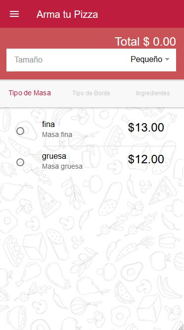

# APP-PIZZERIA

## Tabla de Contenido

* [Requisitos](#requisitos)
* [Instalacion](#instalacion)
* [Deployment](#deployment)
* [Pantallas](#pantallas)
  - [HomePage](#homepage)
  - [Perfil](#perfil)
  - [Favoritas](#favoritas)
  - [Combos Promocionales](#combos-promocionales)
  - [Tradicionales](#tradicionales)
  - [Armar pizza](#armar-pizza)
  - [Adicionales](#adicionales)
  - [Resumen](#resumen)
  - [Carrito](#carrito)
  - [Forma de Entrega](#forma-de-entrega)
  - [Entrega en locales](#entrega-en-locales)
  - [Entrega a domicilio y cobertura](#entrega-a-domicilio-y-cobertura)
  - [Forma de pago](#forma-de-pago)
  - [Rastreo de pedido](#rastreo-de-pedido)
  - [Direcciones favoritas](#direcciones-favoritas)
  - [Reclamos](#reclamos)
* [Pago en linea](#pago-en-linea)
------------------------------------------------------------------------------------

### Requisitos

* [npm](https://www.npmjs.com/)
* [Ionic 3](https://ionicframework.com/docs/)

### Instalacion

Hay que cambiar la `url` en la que se consultan los servicios que la app necesita, esta variable se encuentra en `util/constantes.ts`, la variable es `API_URL`

La app usa el api de **Google Maps**, las key deben de ser colocadas en el `package.json`

```json
"cordova-plugin-googlemaps": {
  "API_KEY_FOR_ANDROID": "<your key>",
  "PLAY_SERVICES_VERSION": "15.0.1",
  "ANDROID_SUPPORT_V4_VERSION": "27.+"
},
```

Tambien las credenciales para el uso de **Firebase**, para los apartados del chat y de las notificaciones push, se realiza la configuracion de keys en `app.module.ts`

```ts
const firebaseConfig={
  apiKey: "<key>",
  authDomain: "<url>",
  databaseURL: "<url>",
  projectId: "<app-id>",
  storageBucket: "<url>",
  messagingSenderId: "<id>"
}
```

Para obtener los datos del usuario para su registro mediante **Facebook**, es necesario colocar el **id** de la app en `package.json`

```json
"cordova-plugin-facebook4": {
  "APP_ID": "<id>",
  "APP_NAME": "Pizzeria App",
  "FACEBOOK_ANDROID_SDK_VERSION": "x.xx.x"
},
```

Este es un proyecto `node` por lo que para instalar las librerias externas necesarias debe ejecutar en la carpeta del proyecto:

```bash
$ npm i
```

Este comando le instalara los paquetes que se encuentran en el archivo `package.json`, creandole una carpeta `node_modules`, la cual no debe de ser tomada en cuenta en su sistema de control de versiones, esto es controlado en el `.gitignore`


### Deployment

Para levantar el entorno de desarrollo localmente, podemos realizarlo de dos maneras:

```bash
$ ionic serve
```

```bash
$ ionic cordova run build
```

Ambas no tienen mayor diferencia, si se desea visualizar el el mapa, la segunda debe de usarse.

### Pantallas

#### HomePage

Codigo en la carpeta `/pages/home`. Se presentan las opciones de menu y **pantalla principal** de la aplicacion

  

#### Perfil

Codigo en la carpeta `/pages/perfil` y `perfil-editar`. Permite visualizar la informacion del usuario y tener la opcion de editarla

  

#### Favoritas

Codigo en la carpeta `/pages/favoritas`. Se presenta un listado de las pizzas favoritas del usuario, estas pueden ser ls creadas o alguna tradicional.


#### Combos Promocionales

Codigo en la carpeta `/pages/combo` y `/pages/detalle-combo`. Se presenta un listado de los combos que ofrece la pizzeria, tambien pueden consultar detalles del combo


#### Tradicionales

Codigo en la carpeta `/page/tradicionales`. Se presenta un listado de las pizzas propias de la pizzeria.


#### Armar pizzas

Codigo en la carpeta `/pages/bordes`, `/pages/crear-pizza`, `/pages/ingredientes`, `/pages/masas`. Esta seccion esta compuesta de varias **pages**, aqui se pueden crear pizzas personalizadas que pueden ser guardadas si el usuario lo desea.




#### Adicionales

Codigo en la carpeta `/pages/adicionales`, `/pages/bebidas`, `pages/acompanantes`. Permite agregar bebidas o acompanantes de un listado de estos.


#### Resumen

Codigo en la carpeta `/pages/resumen-de-pago`. Permite ver un resumen de la orden creada. Ademas de poder agregar a este otro item con opciones de acceso rapido en un menu desplegable


#### Carrito

Codigo en la carpeta `/pages/carrito`, `/pages/carritoP`. Se visualizan las ordenes que estan lista para ser pagadas


#### Forma de Entrega

Codigo en la carpeta `/pages/forma-entrega`. Ofrece opciones de entrega de domicilio o en local


#### Entrega en locales

Codigo en la carpeta `/pages/list-locales`. Permite elegir un local de una lista de locales.


#### Entrega a domicilio y Cobertura

Codigo en la carpeta `/pages/view-map`. Permite elegir manualmente una direccion que es validada si se encuentra dentro de la cobertura de entrega de algun local


#### Forma de pago

Codigo en la carpeta `/pages/forma-pago`. Permite elegir que metodo de pago usaremos.


#### Rastrea tu pedido

Codigo en la carpeta `/pages/pedido`. Visualiza una lista de los pedidos que no han completado su entrega. Podemos observar detalles, estado y chat.


#### Direcciones favoritas

Codigo en la carpeta `/pages/list-ubication`, `pages/view-map`. Se visualiza la lista de direcciones favoritas, aqui se pueden crear direcciones, seleccionando dirrecciones manualmente. Tambien es posible eliminar la direccion creada.


#### Reclamos

Codigo en la carpeta `/pages/reclamos-sugerencias`. Puede enviarse un reclamo o sugerencia al administrador


### Pago en linea

El modulo de pago en linea fue realizado por [Jaminson Riascos](https://github.com/JaminsonR) y [Juniver Roman](https://github.com/juniverjair). El codigo principal se encuentra en otro repositorio. Contactarse con ellos para tener acceso.

### Desarrolladores

- [Ivan Aguirre](https://github.com/navi95f)
- [Kevin Palacios](https://github.com/mrkevinomar)
- [Geancarlo Murillo](https://github.com/gcmurillo)

> Italian Deli Express | Innova System | ESPOL
